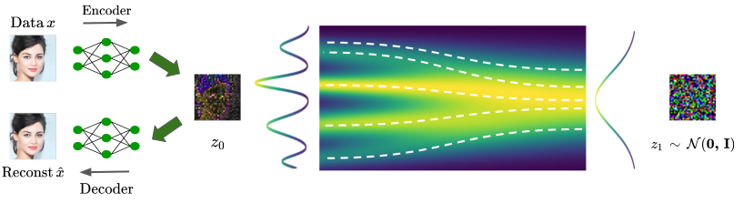

##### Table of contents

1. [Installation](#installation)
2. [Dataset preparation](#dataset-preparation)
3. [Training](#training)
4. [Testing](#testing)
5. [Acknowledgments](#acknowledgments)
6. [Contacts](#contacts)

# Official PyTorch implementation of "Flow Matching in Latent Space"

<div align="center">
  <a href="https://quandao10.github.io/" target="_blank">Quan&nbsp;Dao</a> &emsp; <b>&middot;</b> &emsp;
  <a href="https://hao-pt.github.io/" target="_blank">Hao&nbsp;Phung</a> &emsp; <b>&middot;</b> &emsp;
  <a href="https://tbng.github.io/" target="_blank">Binh&nbsp;Nguyen</a> &emsp; <b>&middot;</b> &emsp;
  <a href="https://sites.google.com/site/anhttranusc/" target="_blank">Anh&nbsp;Tran</a>
  <br> <br>
  <a href="https://www.vinai.io/">VinAI Research</a>
  <br> <br>
  &emsp;&emsp;<a href="https://vinairesearch.github.io/LFM/">[Page]</a> &emsp;&emsp;
  <a href="https://arxiv.org/abs/2307.08698">[Paper]</a> &emsp;&emsp;
  <!-- <a href="https://drive.google.com/file/d/1LSEYfdhS4Zjtx1VRrctmVt6xjEjgmpVA/view?usp=sharing">[Poster]</a> &emsp;&emsp;
  <a href="https://drive.google.com/file/d/11JE-RFtYJWx6XdXH8zZxgzRAvGJ6-IV2/view?usp=sharing">[Slides]</a> &emsp;&emsp;
  <a href="https://youtu.be/KaIMMamhKsU">[Video]</a> -->
</div>
<br>
<div align="center">
  
</div>

> Abstract: Flow matching is a recent framework to train generative models that exhibits impressive empirical performance while being relatively easier to train compared with diffusion-based models. Despite its advantageous properties, prior methods still face the challenges of expensive computing and a large number of function evaluations of off-the-shelf solvers in the pixel space. Furthermore, although latent-based generative methods have shown great success in recent years, this particular model type remains underexplored in this area. In this work, we propose to apply flow matching in the latent spaces of pretrained autoencoders, which offers improved computational efficiency and scalability for high-resolution image synthesis. This enables flow-matching training on constrained computational resources while maintaining their quality and flexibility. Additionally, our work stands as a pioneering contribution in the integration of various conditions into flow matching for conditional generation tasks, including label-conditioned image generation, image inpainting, and semantic-to-image generation. Through extensive experiments, our approach demonstrates its effectiveness in both quantitative and qualitative results on various datasets, such as CelebA-HQ, FFHQ, LSUN Church & Bedroom, and ImageNet. We also provide a theoretical control of the Wasserstein-2 distance between the reconstructed latent flow distribution and true data distribution, showing it is upper-bounded by the latent flow matching objective.

Details of the model architectures and experimental results can be found in [our following paper](https://arxiv.org/abs/2307.08698):

```bibtex
@article{dao2023flow,
  title={Flow matching in latent space},
  author={Dao, Quan and Phung, Hao and Nguyen, Binh and Tran, Anh},
  journal={arXiv preprint arXiv:2307.08698},
  year={2023}
}
```

**Please CITE** our paper whenever this repository is used to help produce published results or incorporated into other software.

**News**
- [24th Dec, 2024] Add pretrained checkpoints for ADM experiments in [Testing](#testing) table.

## Installation

Python `3.10` and Pytorch `1.13.1`/`2.0.0` are used in this implementation.
Please install required libraries:

```
pip install -r requirements.txt
```

## Dataset preparation

For CelebA HQ 256, FFHQ 256 and LSUN, please check [NVAE's instructions](https://github.com/NVlabs/NVAE#set-up-file-paths-and-data) out.

For higher resolution datasets (CelebA HQ 512 & 1024), please refer to [WaveDiff's documents](https://github.com/VinAIResearch/WaveDiff#dataset-preparation).

For ImageNet dataset, please download it directly from [the official website](https://www.image-net.org/download.php).

## Training

All training scripts are wrapped in [run.sh](bash_scripts/run.sh). Simply comment/uncomment the relevant commands and run `bash run.sh`.

## Testing

### Sampling

Run [run_test.sh](bash_scripts/run_test.sh) / [run_test_cls.sh](bash_scripts/run_test_cls.sh) with corresponding argument's file.

```
bash run_test.sh <path_to_arg_file>
```

> Only 1 gpu is required.

<details>

<summary>These arguments are specified as follows:</summary>

```bash
MODEL_TYPE=DiT-L/2
EPOCH_ID=475
DATASET=celeba_256
EXP=celeb_f8_dit
METHOD=dopri5
STEPS=0
USE_ORIGIN_ADM=False
IMG_SIZE=256
```

</details>

Argument's files and checkpoints are provided below:

<table>
  <tr>
    <th>Exp</th>
    <th>Args</th>
    <th>FID</th>
    <th>Checkpoints</th>
  </tr>

  <tr>
    <td> celeb_f8_dit </td>
    <td><a href="test_args/celeb256_dit.txt"> test_args/celeb256_dit.txt</a></td>
    <td>5.26</td>
    <td><a href="https://drive.google.com/drive/folders/1tbd1t0Yt3ix1v_OCGWJ7xyeubhCi99ql?usp=share_link">model_475.pth</a></td>
  </tr>

  <tr>
    <td> ffhq_f8_dit </td>
    <td><a href="test_args/ffhq_dit.txt"> test_args/ffhq_dit.txt</a></td>
    <td>4.55</td>
    <td><a href="https://drive.google.com/drive/folders/1jn6xHlaQ72hKk9RtJKo5lvr7SvYMCobU?usp=share_link">model_475.pth</a></td>
  </tr>

  <tr>
    <td> bed_f8_dit </td>
    <td><a href="test_args/bed_dit.txt"> test_args/bed_dit.txt</a></td>
    <td>4.92</td>
    <td><a href="https://drive.google.com/drive/folders/1o1uDrTAPIENHRh56CdVdGiEHGNqKcaC8?usp=share_link">model_550.pth</a></td>
  </tr>
  <tr>
    <td> church_f8_dit </td>
    <td><a href="test_args/church_dit.txt"> test_args/church_dit.txt</a></td>
    <td>5.54</td>
    <td><a href="https://drive.google.com/drive/folders/15ONlqM2eNbA91j7BikWPQG_6RH80NUwz?usp=share_link">model_575.pth</a></td>
  </tr>

  <tr>
    <td> imnet_f8_ditb2 </td>
    <td><a href="test_args/imnet_dit.txt"> test_args/imnet_dit.txt</a></td>
    <td>4.46</td>
    <td><a href="https://drive.google.com/file/d/1SUc9M85WOfi4CZfRJkpf2tDu3g9dC3YI/view?usp=sharing">model_875.pth</a></td>
  </tr>

  <tr>
    <td> celeb512_f8_adm </td>
    <td><a href="test_args/celeb512_adm.txt"> test_args/celeb512_adm.txt</a></td>
    <td>6.35</td>
    <td><a href="https://drive.google.com/drive/folders/1lWE9hCqzZ2Q1mS2BmTsA3nYWB_T25wqV?usp=share_link">model_425.pth</a></td>
  </tr>

  <tr>
    <td> celeba_f8_adm </td>
    <td><a href="test_args/celeb256_adm.txt"> test_args/celeb256_adm.txt</a></td>
    <td>5.67</td>
    <td><a href="https://drive.google.com/file/d/1AIuMr5Ewti6_wQAJdM9elsrERwrxI9Sb/view?usp=drive_link">model_480.pth</a></td>
  </tr>

  <tr>
    <td> ffhq_f8_adm </td>
    <td><a href="test_args/ffhq_adm.txt"> test_args/ffhq_adm.txt</a></td>
    <td>6.12</td>
    <td><a href="https://drive.google.com/file/d/1ZxOhFvG-zho5WNXfDC4KcFne_y1Tln2K/view?usp=drive_link">model_325.pth</a></td>
  </tr>

  <tr>
    <td> bed_f8_adm </td>
    <td><a href="test_args/bed_adm.txt"> test_args/bed_adm.txt</a></td>
    <td>7.05</td>
    <td><a href="https://drive.google.com/file/d/1BGXNXy8cS4lKt5BN2tV5W6w89bR69M9l/view?usp=drive_link">model_425.pth</a></td>
  </tr>

  <tr>
    <td> church_f8_adm </td>
    <td><a href="test_args/church_adm.txt"> test_args/church_adm.txt</a></td>
    <td>7.7</td>
    <td><a href="https://drive.google.com/file/d/178RJQ6_HH-lqto1hhaN-vGwCC5npHzn-/view?usp=drive_link">model_425.pth</a></td>

  </tr>
  <tr>
    <td> imnet_f8_adm </td>
    <td><a href="test_args/imnet_adm.txt"> test_args/imnet_adm.txt</a></td>
    <td>8.58</td>
    <td><a href="https://drive.google.com/file/d/1vrHrp4fjhUtlQumIQ3f-36i-XdtGM8Rv/view?usp=drive_link">model_1125.pth</a></td>
  </tr>

</table>

Please put downloaded pre-trained models in `saved_info/latent_flow/<DATASET>/<EXP>` directory where `<DATASET>` is defined as in [bash_scripts/run.sh](./bash_scripts/run.sh).

<details>
<summary>Utilities</summary>

To measure time, please add `--measure_time` in the script.

To compute the number of function evaluations of adaptive solver (default: `dopri5`), please add `--compute_nfe` in the script.

To use fixed-steps solver (e.g. `euler` and `heun`), please add `--use_karras_samplers` and change two arguments as follow:

```
METHOD=heun
STEPS=50
```

</details>

### Evaluation

To evaluate FID scores, please download pre-computed stats from [here](https://drive.google.com/drive/folders/1BXCqPUD36HSdrOHj2Gu_vFKA3M3hJspI?usp=share_link) and put it to `pytorch_fid`.

Then run `bash run_test_ddp.sh` for unconditional generation and `bash run_test_cls_ddp.sh` for conditional generation. By default, multi-gpu sampling with 8 GPUs is supported for faster compute.

<details>
<summary>Computing stats for new dataset</summary>

`pytorch_fid/compute_dataset_stat.py` is provided for this purpose.

```bash
python pytorch_fid/compute_dataset_stat.py \
  --dataset <dataset> --datadir <path_to_data> \
  --image_size <image_size> --save_path <path_to_save>
```

</details>

## Acknowledgments

Our codes are accumulated from different sources: [EDM](https://github.com/NVlabs/edm), [DiT](https://github.com/facebookresearch/DiT.git), [ADM](https://github.com/openai/guided-diffusion), [CD](https://github.com/openai/consistency_models.git), [Flow Matching in 100 LOC by François Rozet](https://gist.github.com/fd6a820e052157f8ac6e2aa39e16c1aa.git), and [WaveDiff](https://github.com/VinAIResearch/WaveDiff). We greatly appreciate these publicly available resources for research and development.

## Contacts

If you have any problems, please open an issue in this repository or ping an email to [kevinquandao10@gmail.com](mailto:kevinquandao10@gmail.com) / [tienhaophung@gmail.com](mailto:tienhaophung@gmail.com).
